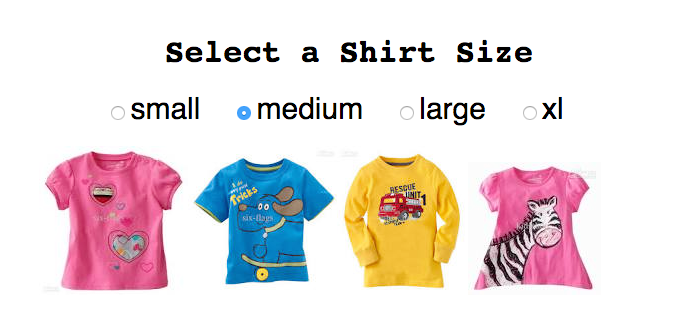

# Shirt Sizes

Going to be a TDD app, using Webpack, React & Redux




[http://shirts.surge.sh/](http://shirts.surge.sh/)

## Styleguides

### Git Commit Messages

* Use the present tense ("Add feature" not "Added feature")
* Use the imperative mood ("Move cursor to..." not "Moves cursor to...")
* Limit the first line to 72 characters or less
* Reference issues and pull requests liberally
* Consider starting the commit message with an applicable emoji:
    * :art: `:art:` when improving the format/structure of the code
    * :racehorse: `:racehorse:` when improving performance
    * :non-potable_water: `:non-potable_water:` when plugging memory leaks
    * :memo: `:memo:` when writing docs
    * :penguin: `:penguin:` when fixing something on Linux
    * :apple: `:apple:` when fixing something on Mac OS
    * :checkered_flag: `:checkered_flag:` when fixing something on Windows
    * :bug: `:bug:` when fixing a bug
    * :fire: `:fire:` when removing code or files
    * :green_heart: `:green_heart:` when fixing the CI build
    * :white_check_mark: `:white_check_mark:` when adding tests
    * :lock: `:lock:` when dealing with security
    * :arrow_up: `:arrow_up:` when upgrading dependencies
    * :arrow_down: `:arrow_down:` when downgrading dependencies
    * :shirt: `:shirt:` when removing linter warnings

[style guide by atom](https://github.com/atom/atom/blob/master/CONTRIBUTING.md)


## To Deploy

```
npm run deploy
```
